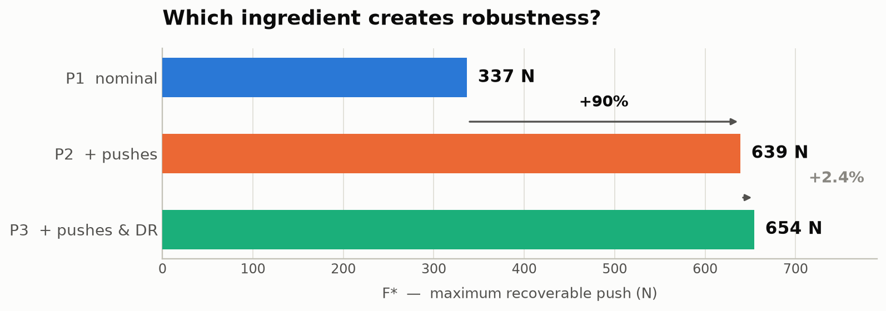
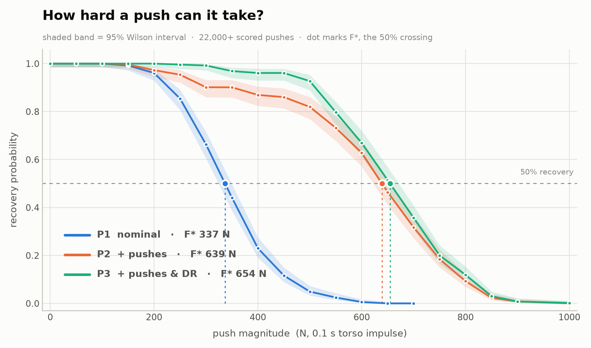
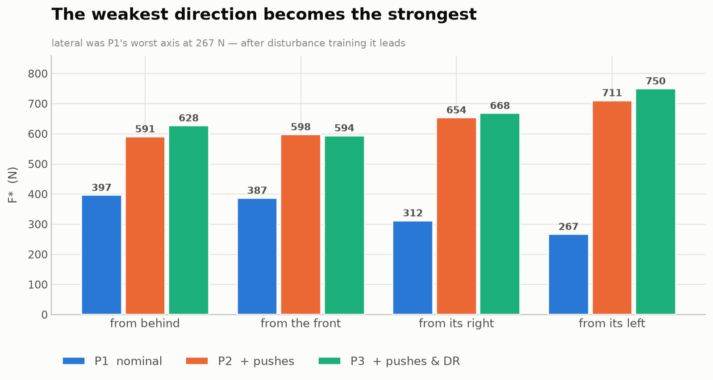

# Robust Humanoid Locomotion Under Unexpected Disturbances

I trained three Unitree G1 policies in MuJoCo that are identical in every way
except one: what happened to them while they were learning to walk.

Then I shoved all three, 22,000 times, and measured which ones got back up.


Same robot. Same seed. Same command. The same 550 N shove at the same instant.
**Only the training distribution differs.**

---

## The question

Everyone who trains locomotion policies knows the recipe: add random pushes, add
domain randomization, get a robust policy. It's in every legged-RL repo. But the
recipe bundles two different interventions together, and nobody running it usually
stops to ask *which half is doing the work.*

So I separated them.

| | trained with |
|---|---|
| **P1** — nominal | nothing. Clean floor, clean robot, no disturbances. |
| **P2** — + pushes | random torso impulses up to 346 N, every 2–5 seconds. |
| **P3** — + pushes & DR | the same impulses, **plus** randomized friction, mass, joint damping, actuator gains, sensor bias. |

Everything else is byte-identical: the same 16-term reward function, the same
observations, the same network, the same seed, the same 4096 environments, the
same 6600 PPO iterations. The *only* thing that changes is the event dictionary.

That's not a claim you should take on faith, so it's mechanically checked —
`scripts/r1_verify_variants.py` diffs reward weights, observation terms, command
ranges, episode length and curriculum across all three arms and exits non-zero if
anything outside `events` differs.

---

## How I measured it

I needed one number that means "how hard a push can this policy survive," so:

**F\*** — the push magnitude at which the policy recovers exactly 50% of the time.

A 0.1 s impulse to the torso, applied at an exact instant while the robot walks
forward at 1.0 m/s. Swept from 0 to 1000 N across four directions, 64 environments
per cell. The protocol shape is borrowed from the published G1 push-recovery
benchmark so these numbers can be compared against something other than themselves.

"Recovered" is deliberately strict:

> Within 3 seconds of the push: never exceeded 45° of tilt, tilt returned below
> 15°, **and** velocity tracking returned to within 1.5× its pre-push error — both
> held continuously for half a second.

That last clause matters more than it looks. Without it, a policy that survives by
freezing in a terrified crouch scores a perfect recovery. The whole point is to
keep *walking*, so the metric has to agree with the reward about that.

---

## Result 1 — pushes do almost all of the work

<picture>
  <source media="(prefers-color-scheme: dark)" srcset="results/figures/ablation_dark.png">
  
</picture>

Training with disturbances **nearly doubles** the recoverable push. Adding the
entire domain-randomization stack on top of that buys **+2.4%** — and in one
direction it actually made things slightly *worse* (598 N → 594 N).

Here's the full picture:

<picture>
  <source media="(prefers-color-scheme: dark)" srcset="results/figures/recovery_curves_dark.png">
  
</picture>

Look at the gap between the blue curve and the other two. Then look at how tightly
orange and green track each other. That's the finding.

This lines up with [Xie et al. (2020)](https://arxiv.org/abs/2011.02404), who found
dynamics randomization isn't always necessary — a genuinely contested claim, tested
here on a humanoid with a three-arm ablation rather than a two-way comparison.

**One honest caveat, and it's a big one.** This measures robustness to *forces*.
P2 has never once seen a different friction coefficient or a different mass. The
axis where domain randomization *should* earn its keep — transfer to a robot that
isn't the one you trained on — is specified in `configs/protocol.yaml` and **has
not been run yet**. Please don't read this as "domain randomization is useless."
Read it as "on the force axis, it wasn't what mattered."

---

## Result 2 — the one I didn't expect

Bipeds are supposed to be weakest sideways. The frontal plane has almost no base of
support compared to the sagittal plane, so a lateral shove should be the hardest to
absorb. My nominal policy agrees: lateral is its worst direction by a wide margin,
267 N against 397 N from behind.

Then I looked at the trained policies.

<picture>
  <source media="(prefers-color-scheme: dark)" srcset="results/figures/fstar_by_direction_dark.png">
  
</picture>

**The weakest axis became the strongest.** 267 N → 711 N, a 166% gain, while the
sagittal directions improved by roughly 50%.

I don't think this means lateral balance is easy. I think it means the frontal
plane is where the *most headroom* was sitting, precisely because nothing in
ordinary flat-ground walking ever forces you to practice it. The textbook result
measures untrained policies and quietly attributes to morphology something that is
partly a property of the training distribution.

---

## The story in three clips

**The problem.** One policy, two runs. Left is undisturbed; right gets shoved. This
robot walks a flawless 1000/1000-step episode and recovers from this particular
push 1.6% of the time.


**The intervention.** Same push, same seed. The only difference is that the robot
on the right was pushed around during training.


Learning to walk is not learning to recover. They're different skills, and you only
get the second one if you train for it.

---

## What broke along the way

Honestly, this is the part I'd read first if I were you. The full account is in
[`docs/ENGINEERING_LOG.md`](docs/ENGINEERING_LOG.md); every entry states what
looked fine, what was actually wrong, and the measurement that told them apart.

**The metric quietly threw away every failure.**
Early sweeps reported 100% recovery up to 300 N. Very plausible! Then I looked at
the sample counts: `n=2` out of 32 at 600 N, and `n=0` at 1000 N. The push event
cleared its per-environment state *inside* `env.step`, so any episode that fell and
reset erased its own evidence before the tracker could score it. Recovery rate is
computed over scored episodes — and the ones being dropped were **exactly the
failures**. The metric would have reported the policy as invincible in precisely
the regime where it was collapsing.
*Every rate in this repo now ships with its `n`.*

**The video showed the opposite of what happened.**
A clip showed the nominal policy strolling along calmly after a 550 N push that it
fails **128 times out of 128**. What actually happened: it fell at t≈3.2 s, the
episode terminated, **reset**, and the robot stood up and walked again inside the
same clip. A frame grabbed at t=8 s reads as "shrugged it off."
*Fall termination is now disabled for video rendering, and the renderer refuses to
emit a clip whose push never fired.*

**A domain-randomization term cost 4 GB and made training 9× slower.**
`dr.pseudo_inertia` — the physically correct way to randomize mass — turned
4.7 s/iteration into 43 s. That's 79 hours instead of 10. Its overhead is nearly
independent of environment count (5,649 MB at 1024 envs, 5,914 MB at 2048), so it's
the `set_const` recomputation, not per-env storage.
*And the diagnostic I wrote to find it initially blamed the wrong term, because the
probe leaked warp allocations between variants — a memory leak inside the memory-leak
detector.*

**Single clips at probabilistic forces aren't reproducible.**
Two renders at an identical 450 N and identical seed gave opposite outcomes.
MuJoCo-Warp on GPU isn't bit-deterministic, and the nominal policy recovers 1.6% of
the time at that force. Re-rendering until you get the outcome you wanted is
cherry-picking, full stop.
*Videos now use conditions where the outcome isn't a coin flip — 550 N lateral,
where P1 failed 128/128 — and captions state the measured probability.*

---

## Running it yourself

All of this was trained on a **laptop RTX 3060 with 6 GB of VRAM**. About 9.5 hours
per policy, 28 hours total. No cluster.

```bash
pip install -r requirements.txt

python scripts/r0_audit.py             # verify environment, pins, reward audit
python scripts/r1_verify_variants.py   # prove the arms differ only in `events`

./scripts/run_train.sh p1nominal Unitree-G1-Robust-P1-Nominal 4096 6600
./scripts/run_sweep.sh checkpoints/p1_nominal/model_6599.pt p1_nominal

python scripts/analyze_sweep.py results/push/p1_nominal
python scripts/collect_metrics.py      # rebuild every number from raw artifacts
python scripts/make_figures.py         # rebuild every figure above
```

The version pins in `requirements.txt` are load-bearing, not cosmetic. torch 2.13
resolves to a CUDA 13 build and silently trains on CPU against a CUDA 12 driver;
mujoco ≥ 3.11 breaks `import mujoco_warp`; warp-lang ≥ 1.13 moved `wp.context`.
Each one cost time to discover.

---

## The data

No number in this README was typed by hand. Everything is derived from raw
artifacts by `scripts/collect_metrics.py`, and every figure is regenerated from
that by `scripts/make_figures.py`.

| file | what's in it |
|---|---|
| `results/metrics/all_metrics.json` | everything — curves, F\*, intervals, training traces |
| `results/metrics/curves.csv` | policy × direction × force → recovery rate |
| `results/metrics/curves_overall.csv` | aggregated, with Wilson confidence intervals |
| `results/metrics/fstar.csv` | policy × direction → F\* |
| `results/push/*/` | raw sweeps: `results.json`, per-episode CSV, plots |
| `checkpoints/` | all four trained policies |

Branches `p1-nominal`, `p2-push` and `p3-robust` each isolate one arm's checkpoint,
sweep and video, with a `POLICY.md` describing it. `main` has everything.

---

## What this isn't

- **It's simulation.** There is no real-robot validation here and I'm making **no
  sim-to-real claim**. `F*` in MuJoCo is partly a property of the contact solver.
  Treat it as a *relative* measure across these three policies, not a spec.
- **Domain randomization hasn't had its fair test.** The unseen-dynamics evaluation
  is written down but not run. P3's real case is still open.
- **Mass randomization models a point mass at the CoM** — a payload — not a density
  change, because the physically correct term was unaffordable on 6 GB.
- **One robot, flat ground, one gait speed.**
- **P1 is a strong baseline, not a strawman.** It converges to the *best* nominal
  walker of the three: reward 37.0, a full 1000/1000-step episode, 0.0% falls when
  undisturbed. It just can't take a shove.

---

## Credit where it's due

Built on [**unitree_rl_mjlab**](https://github.com/unitreerobotics/unitree_rl_mjlab),
[**mjlab**](https://github.com/mujocolab/mjlab), and
[**MuJoCo**](https://github.com/google-deepmind/mujoco) / MuJoCo-Warp. The G1 model,
the base velocity task, the PPO runner and the manager framework are all upstream
work.

What's mine is the study: the deterministic push
(`src/tasks/velocity/mdp/disturbance.py`), the recovery metric
(`recovery_metrics.py`), the three ablation arms (`robust_env_cfg.py`), the
evaluation and analysis tooling, the frozen protocol, and the writeup.

**License: [Apache 2.0](LICENSE)** — the same license as everything it builds on.
[`NOTICE`](NOTICE) records the attribution chain and lists exactly what I added,
changed and removed, which is what Apache §4(b) asks of a derivative work. Use it
freely; keep the notices.

Non-G1 robot meshes were removed to keep the repo small; their constants modules
stay, because the package imports them.
